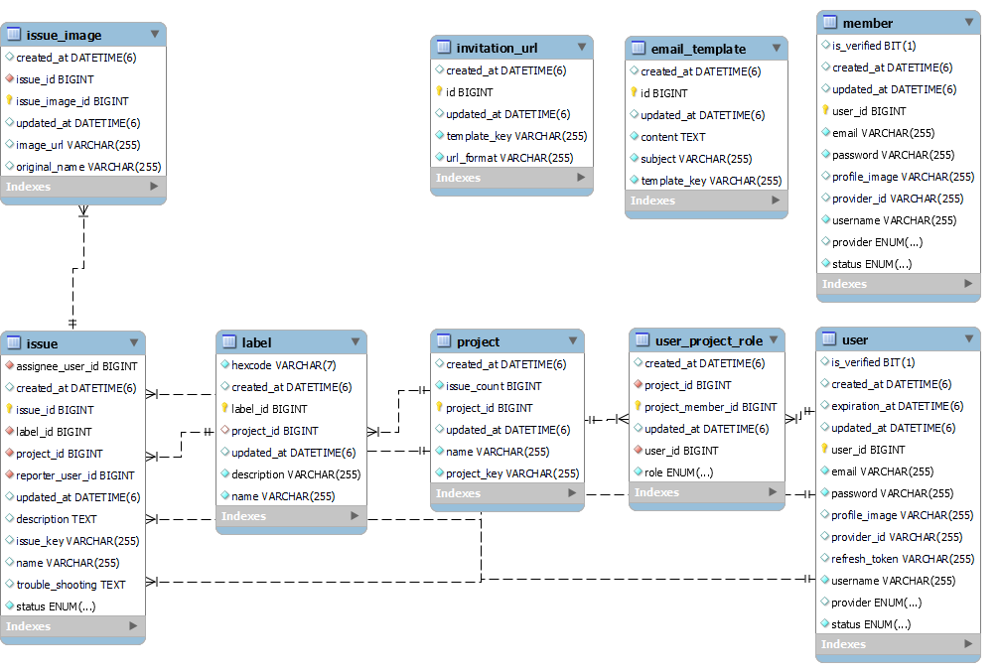
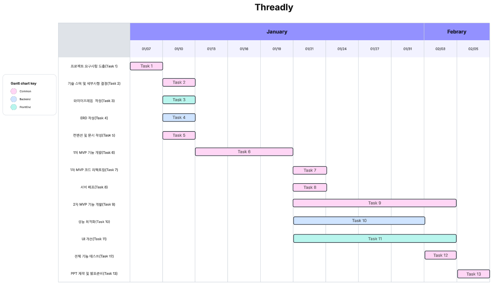
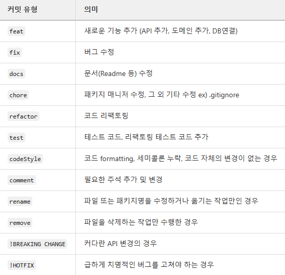
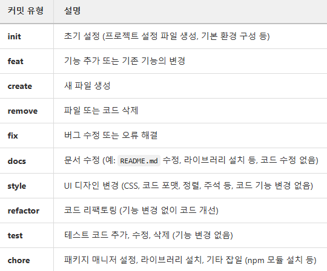

# 🚀 Threadly
**Threadly는 기존의 협업 도구인 Jira에 실시간 채팅 기능을 더한 서비스입니다.**

---

## 📌 기술 스택

### 🔹 백엔드
  
  
  
  
  
  
  

### 🔹 프론트엔드
  
  

### 🔹 배포

---

## 🏗️ 시스템 아키텍처

---

## 🗂 ERD

---

## 🎨 와이어프레임
👉 [Figma 링크](https://www.figma.com/design/jPUtIC4aj6eWIFThgUOOIN/%EC%97%98%EB%A6%AC%EC%8A%A4-%ED%8F%AC%ED%8A%B8%ED%8F%B4%EB%A6%AC%EC%98%A4%ED%8A%B8%EB%9E%99-1%EC%B0%A8-%ED%94%84%EB%A1%9C%EC%A0%9D%ED%8A%B8?node-id=0-1&p=f&t=KZs31uNgFLwv4KjM-0)

---

## 📅 일정 관리

---

## 📜 코드 컨벤션

### 🔹 백엔드

### 🔹 프론트엔드

---

## 🚀 기능

### ✅ 메인 기능
- **프로젝트 관리**: 프로젝트 생성, 수정, 삭제 및 권한 관리
- **이슈 관리**: 이슈 생성, 배정, 상태 변경 및 삭제
- **실시간 채팅**: **WebSocket**를 활용한 프로젝트 내 팀원 간 실시간 채팅
- **사용자 관리**: 회원가입, 로그인, 권한 설정 및 초대

### 📌 추가 기능
- **이메일 초대 시스템**
- **프로젝트 검색 및 필터링**
- **이슈 상태 트래킹**
- **이슈 검색 및 필터링**
- **캐싱 및 성능 최적화 (Redis 활용)**
- **보안 강화 (JWT 기반 인증 및 인가, 리프레시 토큰 지원)**
- **GitLab Runner를 활용한 CI/CD 자동 배포**
